1. O que é uma classe em Java e qual é a diferença entre uma classe e um objeto? Dê 5 exemplos mostrando-os em C++ e em Java.
   - R:  Em Java, uma classe é uma estrutura fundamental que define o comportamento e as propriedades de objetos. Uma classe é um modelo para a criação de objetos, e os objetos são instâncias dessa classe. As classes são usadas para organizar e estruturar o código em Java, facilitando a reutilização e a manutenção. Já um objeto é uma instância específica de uma classe. É uma entidade real que existe em tempo de execução.Ele possui valores específicos para os atributos definidos pela classe e pode realizar as operações definidas pelos métodos da classe. segui a baixo os exemplos:
   - Exemplo 1 em C++
     - 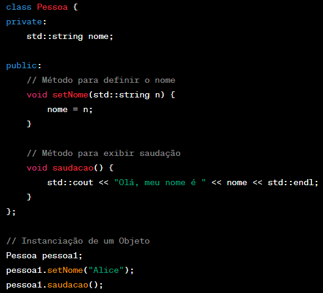
   - Exemplo 2 em C++
     - 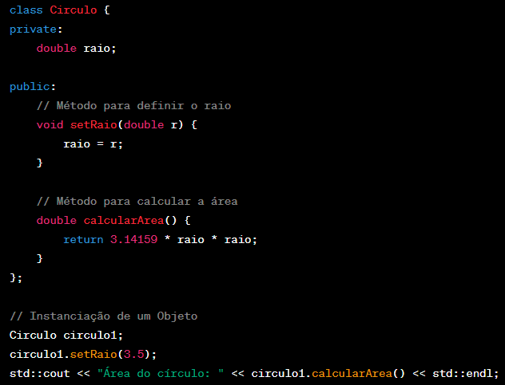
   - Exemplo 3 em C++
     - 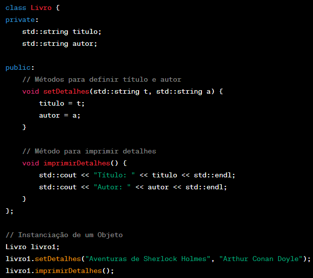
   - Exemplo 4 em C++
     - 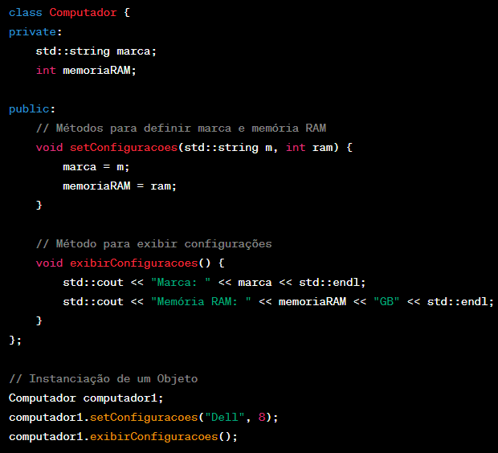
   - Exemplo 5 em C++
     - 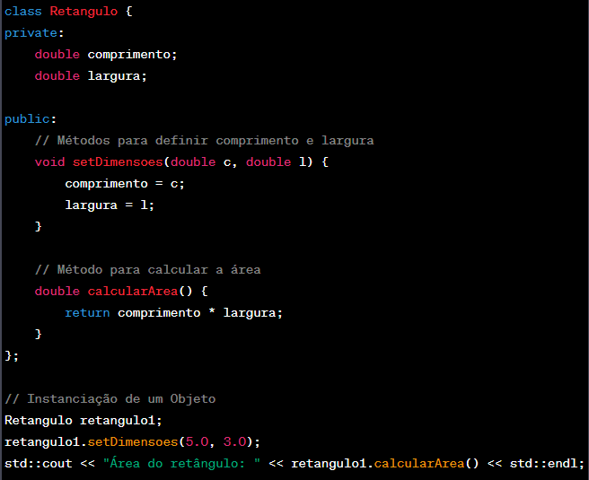
   - Exemplo 1 em Java
     - 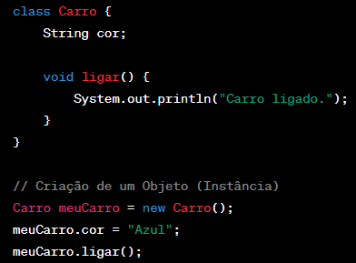
   - Exemplo 2 em Java
     - 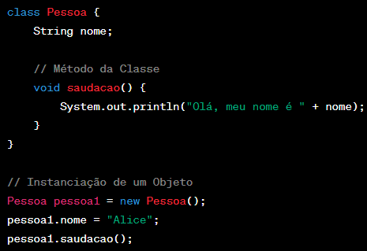
   - Exemplo 3 em Java
     - 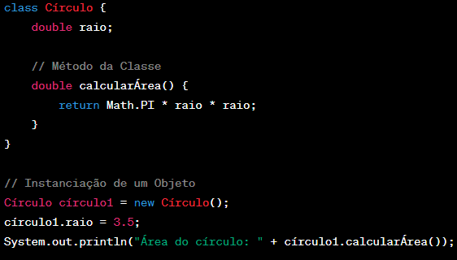
   - Exemplo 4 em Java
     - 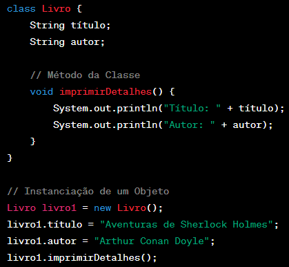
   - Exemplo 5 em Java
     - 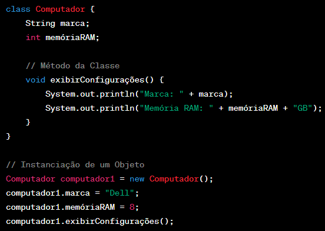
   

2. Como você declara uma variável em Java e quais são os tipos de dados primitivos mais comuns? Faça um paralelo entre isso e a mesma coisa na linguagem C++.
   - R: Para declarar uma variável em Java, é preciso informar o tipo de dado que ela receberá e o nome da variável em seguida, semelhante ao C++ " int x; ".
     - os tipos de dados primitivos mais comuns em Java:
       - byte
       - short
       - int
       - float
       - double
       - char
       - boolean
       - long
     - os tipos de dados primitivos mais comuns em C++:
       - short
       - int
       - float
       - double
       - char
       - bool
       - long
       - long long

3. Explique o conceito de herança em Java e como você pode criar uma subclasse a partir de uma classe existente. Faça um paralelo com C++, apresentando 5 exemplos.
    - R: A herança é um conceito fundamental em programação orientada a objetos que permite criar uma nova classe, chamada subclasse, baseada em uma classe existente, chamada superclasse. A ideia principal é herdar as características (atributos e métodos) da superclasse, promovendo a reutilização de código e estabelecendo uma relação "é-um" entre as classes. Em Java, a herança é implementada usando a palavra-chave extends.
  
      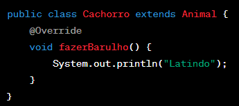

    - Paralelo com C++:
        - Sintaxe de herança:
          - Java: 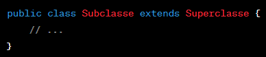
          - C++: 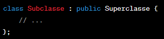
        - Construtor:
          - Java: Obs( Utiliza 'super()' para chamar explicitamente o construtor da superclasse.) 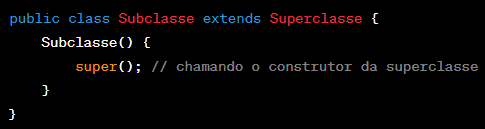
          - C++: Obs(O construtor da superclasse é chamado automaticamente quando um objeto da subclasse é criado.) 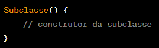
        - Sobrescrita:
          - Java: Obs(Usa a anotação "@Override" para indicar a intenção de sobrescrever um método.) 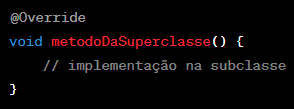
          - C++: Obs(Não exige uma palavra-chave para indicar a sobrescrita de um método.) 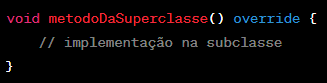
        - Herança Múltipla:
          - Java: Obs(Não suporta herança múltipla de classes. No entanto, interfaces podem ser usadas para alcançar um tipo de herança múltipla.) 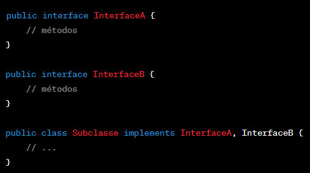
          - C++: Obs(Suporta herança múltipla de classes, o que significa que uma classe pode herdar de várias classes.) 
    - Em resumo, enquanto a ideia fundamental de herança é semelhante em ambas as linguagens, a sintaxe exata e algumas características específicas podem variar. Java tende a ser mais rigoroso em certos aspectos, como herança múltipla, por razões de segurança e simplicidade, enquanto C++ oferece mais flexibilidade, permitindo herança múltipla e não exigindo a palavra-chave "override" para indicar sobrescrita de métodos.
          
4. Quando declaramos uma variável em Java, temos, na verdade, um ponteiro. Em C++ é diferente. Discorra sobre esse aspecto.
   - R:  Pois em Java, a abstração é mais uniforme, Porque todas as variáveis de objeto são referências, enquanto em C++, você tem a flexibilidade de escolher entre armazenar o objeto diretamente ou usar ponteiros/referências. Isso pode levar a diferenças na manipulação da memória e nas práticas de programação, já que em C++ você tem mais controle direto sobre a gestão de memória.

